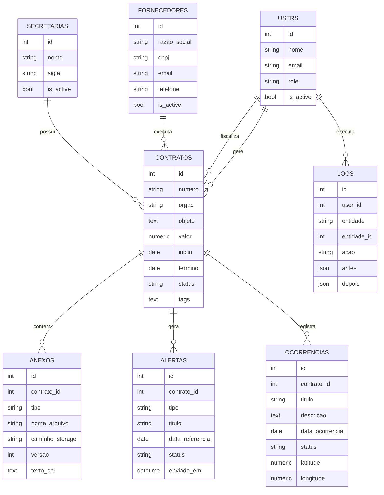

# Sprint 1 - Modelagem do banco e arquitetura backend

## Objetivo

Estabelecer a base tecnica do FiscalBot para sustentar o MVP de gestao contratual, alertas, documentos, dashboard e auditoria.

## Stack definida

- API: FastAPI
- ORM: SQLAlchemy 2
- Schemas: Pydantic
- Banco principal: PostgreSQL
- Migracoes: Alembic
- Jobs futuros: Redis + Celery
- Empacotamento local: `pyproject.toml`

## Estrutura backend

```text
app/
  api/v1/routes/      Endpoints REST por dominio
  core/               Configuracoes da aplicacao
  db/                 Engine, sessao e metadata
  models/             Entidades SQLAlchemy
  schemas/            Contratos de entrada/saida da API
  services/           Regras de negocio e agregacoes
  web/                Dashboard HTML inicial
migrations/           Historico Alembic
scripts/              Rotinas operacionais e seeds
tests/                Testes automatizados
```

## Modelo de dados inicial



## Endpoints iniciais

- `GET /health`
- `GET /api/v1/dashboard`
- CRUD de `secretarias`
- CRUD de `fornecedores`
- CRUD de `users`
- CRUD de `contratos`
- Listagem de `alertas`

## Regras estruturais da Sprint 1

- Contratos nao podem ter valor negativo.
- Contratos nao podem terminar antes da data de inicio.
- Indicadores nao podem ter valor negativo.
- Coordenadas de ocorrencias devem respeitar latitude entre -90 e 90 e longitude entre -180 e 180.
- Chaves unicas principais: numero do contrato, CNPJ do fornecedor, email do usuario e nome da secretaria.

## Proximas decisoes tecnicas

- Definir autenticacao JWT e politica de perfis.
- Separar regras de auditoria em middleware/service.
- Criar endpoints de upload para anexos.
- Implementar gerador de alertas com Celery.
- Adicionar testes com banco isolado para CRUD e migracoes.
